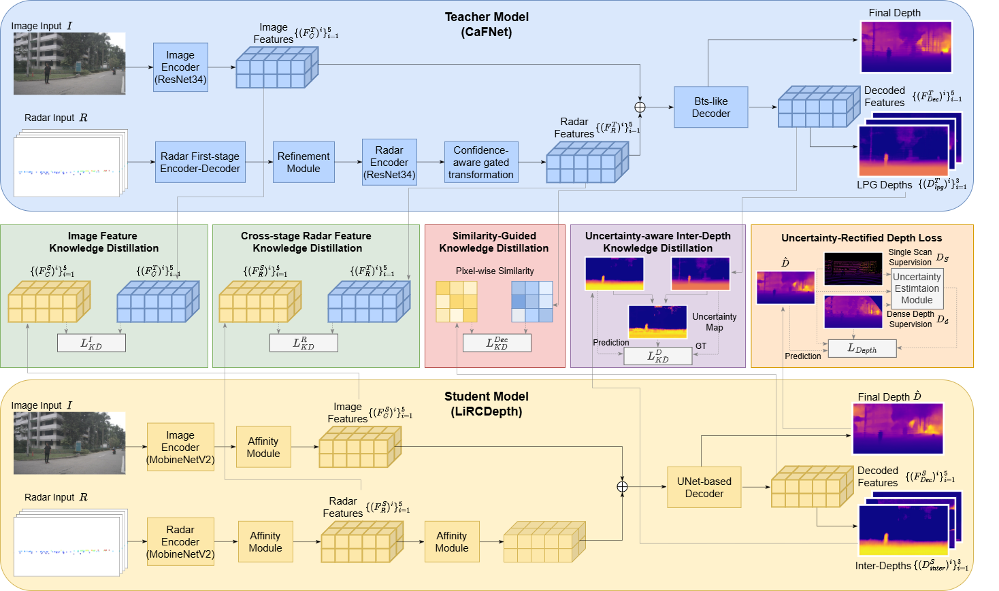

# LiRCDepth

Pytorch implementation of LiRCDepth: Lightweight Radar-Camera Depth Estimation via Knowledge Distillation and Uncertainty Guidance (Accepted by ICASSP 2025)

Paper link: https://www.arxiv.org/pdf/2412.16380

Models have been tested using Python 3.7/3.8, Pytorch 1.10.1+cu111

## Introduction



**Abstract:** Recently, radar-camera fusion algorithms have gained significant attention as radar sensors provide geometric information that complements the limitations of cameras. However, most existing radar-camera depth estimation algorithms focus solely on improving performance, often neglecting computational efficiency. To address this gap, we propose LiRCDepth, a lightweight radar-camera depth estimation model. We incorporate knowledge distillation to enhance the training process, transferring critical information from a complex teacher model to our lightweight student model in three key domains. Firstly, low-level and high-level features are transferred by incorporating pixel-wise and pair-wise distillation. Additionally, we introduce an uncertainty-aware inter-depth distillation loss to refine intermediate depth maps during decoding. Leveraging our proposed knowledge distillation scheme, the lightweight model achieves a 6.6% improvement in MAE on the nuScenes dataset compared to the model trained without distillation.

## Setting up dataset
To set up the dataset, please refer to the [CaFNet repo](https://github.com/harborsarah/CaFNet).

## Training LiRCDepth
To train LiRCDepth on the nuScenes dataset, you may run:
```
python main_student.py arguments_train_nuscenes_student.txt arguments_test_nuscenes.txt
```

## Evaluating LiRCDepth
To evaluate LiRCDepth the nuScenes dataset, you may run:
```
python test_student.py arguments_test_nuscenes_student.txt 
```
You may replace the path dirs in the arguments files.

## Acknowledgement
Our work builds on and uses code from [radar-camera-fusion-depth](https://github.com/nesl/radar-camera-fusion-depth), [bts](https://github.com/cleinc/bts). We'd like to thank the authors for making these libraries and frameworks available.

## Citation
If you use this work, please cite our paper:

@misc{lircdepth,
      title={LiRCDepth: Lightweight Radar-Camera Depth Estimation via Knowledge Distillation and Uncertainty Guidance}, 
      author={Huawei Sun and Nastassia Vysotskaya and Tobias Sukianto and Hao Feng and Julius Ott and Xiangyuan Peng and Lorenzo Servadei and Robert Wille},
      year={2024},
      eprint={2412.16380},
      archivePrefix={arXiv},
      primaryClass={cs.CV},
      url={https://arxiv.org/abs/2412.16380}, 
}
